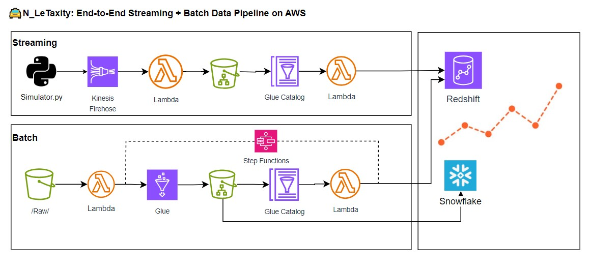

## 🚖 N_LeTaxity: NYC Taxi Streaming + Batch Data Pipeline

Welcome to N_LeTaxity — A cloud-native data engineering project showcasing streaming & batch pipelines, Snowflake and Redshift data warehousing, and real-time analytics on NYC Taxi data.

---

## 📊 Project Highlights

* **Python**: Simulation script to emulate live NYC taxi traffic.
* **Kinesis Firehose**: Streaming ingestion of real-time trip data.
* **S3 + AWS Glue + Step Functions**: Batch ingestion and ETL orchestration.
* **S3 Data Lake**: Organized storage into raw/ and processed/ zones.
* **Redshift Serverless**: Centralized analytics warehouse for both streaming and batch data.
* **Snowflake**: Cloud data warehouse integration for benchmark against Redshift.
* **DynamoDB**: Lightweight control and audit logs for improved pipeline observability and recovery.
* **AWS Step Functions**: End-to-end orchestration of automated ETL workflows.
* **Streamlit**: Real-time dashboard with KPIs, graphs, and streaming vs baseline comparisons.

Note: Streaming operates near-real-time (sub-minute) using Serverless AWS services.

---

## 🗺️ Architecture Diagram



---

## 📂 Project Directory Structure

```markdown
├── 📄 README.md — Project documentation  
├── 📊 analytics — Streamlit dashboards & analytics scripts  
├── 🗂 Archived — Historical notes, lessons learned, old reports & test scripts  
├── 🖼️ docs — Architecture diagrams, performance charts, streaming KPIs visuals  
├── 📝 scripts — Batch & Streaming data pipeline code  
│   ├── batch — Lambda scripts for Redshift ETL & Glue triggers  
│   ├── helpers — Shared libraries (e.g., pipeline logger layer)  
│   └── streaming — Streaming ingestion & simulation Lambda functions  
├── 🗄️ sql — SQL DDL & queries  
│   ├── redshift — Redshift DDL, ETL, and adhoc queries  
│   ├── snowflake — Snowflake DDL, ETL, and adhoc queries  
│   └── benchmark — Redshift vs. Snowflake performance   

```

---

## 🌐 AWS Services Used

* **Amazon S3** — Data Lake for raw and processed trip data.
* **AWS Glue Data Catalog** — Metadata management for structured querying.
* **AWS Glue ETL** — Batch data transformation.
* **Amazon Kinesis Data Firehose** — Streaming ingestion to S3.
* **AWS Lambda** — Serverless compute for data enrichment and transformation.
* **Amazon Redshift Serverless** — Centralized data warehouse for analytics.
* * **Snowflake** — Cloud data warehouse
* **AWS Step Functions** — Managed ETL workflow orchestration.
* **Amazon EventBridge** — Scheduled triggers for streaming pipeline refresh.
* **Amazon DynamoDB** — Lightweight control and audit logging for pipelines.
* **Amazon Athena** — Ad-hoc SQL queries directly on S3-based raw/processed data.
* **Streamlit** — Real-time dashboard and KPI visualization.

---

## 📂 Data Sources

* **Historical Data:** Monthly NYC Yellow & Green taxi trip parquet files from [https://www.nyc.gov/](https://www.nyc.gov/)
* **Streaming Data:** Simulated live taxi trip events based on historical data.

---

## 📊 Redshift Key Tables and Views

* `public.taxi_trip_data`: batch cleaned historical data.
* `public.taxi_streaming_trips`: streaming incoming trip data.
* `public.taxi_zone_lookup`: taxi zones lookup.
* `public.taxi_trip_data_vw`: summarized batch trips.
* `public.taxi_streaming_trips_vw`: summarized streaming trips.
* `public.taxi_trip_simulated_today_vw`: simulated today trips for live comparison.
* `public.taxi_trip_top_traffic_vw`: baseline busiest day for benchmarking.

## 📊 Snowflake Key Tables and Views

* 'NYC_TAXI_DB.BATCH_DATA.TRIP_DATA: batch trip data ingested from S3
* 'NYC_TAXI_DB.BATCH_DATA.TAXI_ZONE_LOOKUP: taxi zone lookup ingested table from S3
* 'NYC_TAXI_DB.BATCH_DATA.TAXI_TRIP_DATA_VW: trip data view 
---
## 📊 Snowflake vs. Redshift Performance Snapshot Comparision
* Results of the same adhoc queries run across Redshift and Snowflake.
  

## 📈 KPI Metrics in Dashboard

* Trip count
* Total fare revenue
* Average trip delay
* Passengers carried
* Trips per minute
* Real-time vs baseline comparison
* Cumulative trip chart

---

## 📸 Sample Dashboard Screenshot


---

## 📚 Future Improvements

* Cost optimization: Iceberg tables or Athena for streaming.
* Predictive analytics: model surge demand zones.
* More realistic simulation based on historical patterns.


## 💡 Inspiration

> "Modern Data Engineering: Combining batch + streaming for near real-time decision making."

---

## 💬 Credits

* NYC Taxi and Limousine Comission.


---

### 🔗 Connect with me

* LinkedIn: https://www.linkedin.com/in/le-nguyen-v/
* GitHub: https://github.com/tropily/
